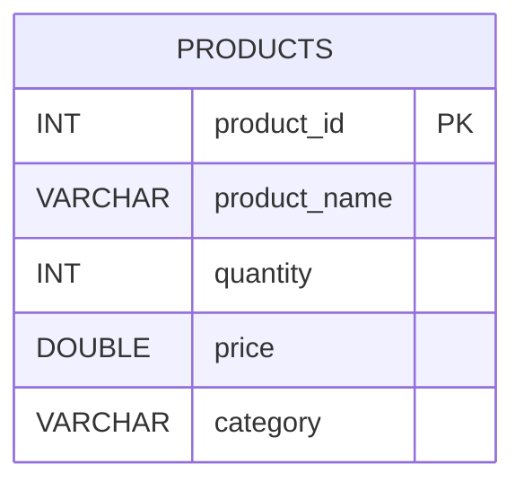
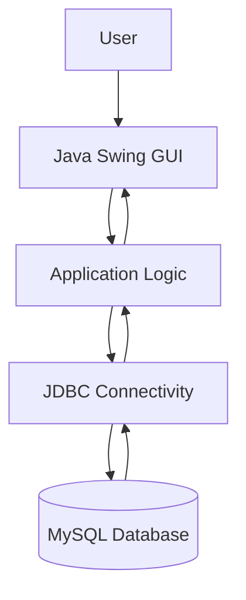
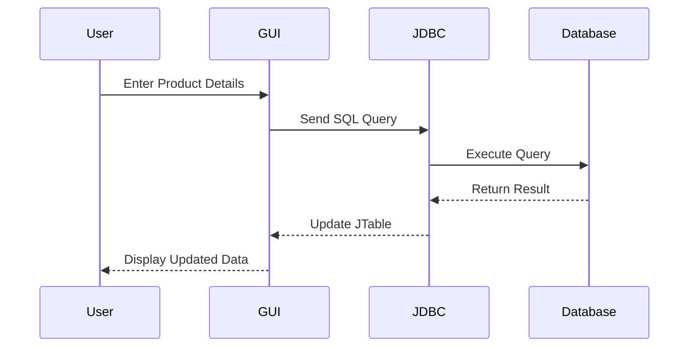

# Inventory Management System

A desktop-based Inventory Management System developed using Java Swing and MySQL.  
The application provides an easy-to-use graphical interface for managing inventory records including product addition, updation, deletion, and viewing stock information.

---

# Project Overview

The Inventory Management System is designed to simplify inventory tracking for small businesses and educational purposes. The system enables users to manage product data efficiently using CRUD (Create, Read, Update, Delete) operations integrated with a MySQL database.

The project demonstrates:
- Java GUI development using Swing
- Database connectivity using JDBC
- Event handling
- SQL database management
- Table data visualization using JTable

---

# Objectives

- Develop a GUI-based inventory management application
- Implement database connectivity using JDBC
- Store and retrieve inventory records from MySQL
- Provide real-time inventory management operations
- Demonstrate practical implementation of Java Swing components

---

# Features

- Add Product
- Update Product
- Delete Product
- Display Inventory Records
- Database Connectivity
- JTable Integration
- Responsive Swing GUI

---

# Technologies Used

| Technology | Purpose |
|---|---|
| Java | Application Development |
| Swing | GUI Framework |
| MySQL | Database |
| JDBC | Database Connectivity |
| VS Code | Development Environment |
| Git & GitHub | Version Control |

---

# Tools Used

| Tool | Usage |
|---|---|
| MySQL Workbench | Database Management |
| Git Bash | Version Control Commands |
| VS Code Extensions | Java Development Support |
| MySQL Connector/J | JDBC Driver |

---

# Project Requirements

## Software Requirements

- Java JDK 17 or above
- MySQL Server
- MySQL Workbench
- VS Code
- Git

## Libraries Required

- MySQL Connector/J

---

# Database Architecture

## Database Name

```sql
inventory_db
```

## Table Structure

### products

| Column Name | Data Type | Description |
|---|---|---|
| product_id | INT | Primary Key |
| product_name | VARCHAR(100) | Product Name |
| quantity | INT | Product Quantity |
| price | DOUBLE | Product Price |
| category | VARCHAR(50) | Product Category |

---

# Database Schema Diagram



---

# System Architecture



---

# Application Workflow



---

# Repository Structure

```text
Inventory-Management-System/
│
├── lib/
│   └── mysql-connector-j-9.x.x.jar
│
├── src/
│   ├── DBConnection.java
│   └── InventoryManagementSystem.java
│
├── .gitignore
├── README.md
└── inventory.sql
```

---


# Future Enhancements

- Login Authentication
- Search Functionality
- Export Reports
- Billing Module
- Dashboard Analytics
- Stock Alerts
- Dark Theme UI
- Cloud Database Integration

---

# Learning Outcomes

This project helps in understanding:
- Java GUI Programming
- Event Driven Programming
- JDBC API
- SQL Query Handling
- Desktop Application Development
- Database Design
- GitHub Project Management

---

# Conclusion

The Inventory Management System successfully demonstrates integration of Java Swing with MySQL database using JDBC. The project provides an efficient solution for inventory handling and serves as a strong foundation for advanced desktop application development.